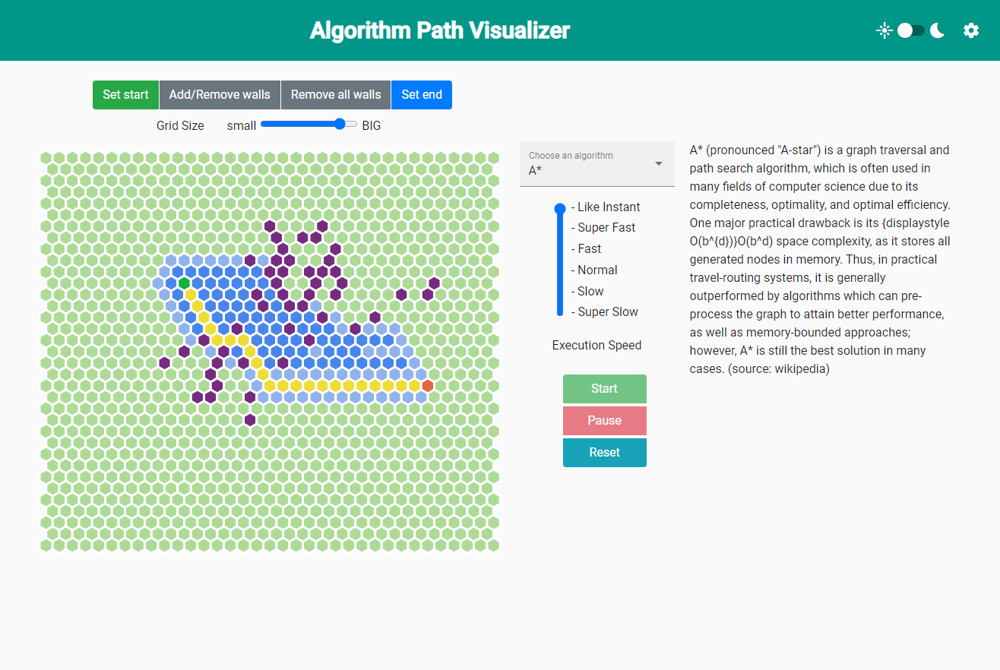

# Path Finding Visualization
## Goal
The goal of this application is to improve know-how and gain more experience of frontend technologies especially ngrx and angular. This application developed naturally and dynamically to what it is now without a great plan at the beginning.

## Concept

This application provides a visualization of path search algorithms (described in more detail in the documentation) on a grid. The screenshot above shows the initial page when accessing the application. The interaction is described more precisely in the [documentation](documentation/documentation.md#interaction). Nevertheless, a quick introduction follows:

The grid symbolizes an empty space, which is all passable/accessible. A start and end cell can be selected by using the controls above the grid. The start cell is dark green in the screenshot above, whereas the end or goal is dark red. Since finding a path on an empty space is rather simple, walls can be added. These are marked by dark blue cells in the screenshot above.

The path finding algorithm can be selected next to the grid on the right side. By clicking on run, the algorithm starts to explore. The process can be paused and continued as well as executed in different speeds, which allows a more detailed look on how algorithms work. 

The colors used to visualize these individual states of a cell can be changed by clicking on the gear wheel in the upper right corner.

## Technology used
##### Angular
The frontend implementation is based on the angular framework. More specific the current major version 11.

##### NGRX - Reactive State for Angular

NgRx Store ist used throughout the application to manage the inner states of the application, namely the state of the graph, the settings and the algorithm settings. Furthermore, these states are "persisted" by saving them to the local storage of the browser. The application states are initialized by these "persisted" states on startup. 

##### P5.js
The graph of hexagons is created dynamically by the javascript framework p5.js. This framework is capable of creating and displaying of dynamic or static graphics. The graph is currently only using hexagons, which might be changed in the future to allow different styles of cells. This can easily be supported by p5 since all forms have to be designed individually.

##### Angular Materials + Bootstrap
Some styling elements, like the buttons, the theming, etc. are based on bootstrap or angular materials. There are still custom classed which should be replaced by bootstrap classes to minimize unnecessary customizations.
#### Local Storage
Although the local storage is not really a "technology" it shall still be listed here. As mentioned in section [NGRX](#ngrx) the application states are persisted in the local storage to allow resuming although the browser window has been closed in between.

## Documentation
A brief documentation can be accessed [here](documentation/documentation.md).

##### Todos
###### Clean up the workflow of setting start/end/walls. 
The current implementation is rather messy regarding the process of setting the start, end and wall cells. This should be cleaned up and handled more efficiently and clean.

###### Move states to modules
The application state is already split up into multiple smaller states. These should be moved to the angular modules to allow a cleaner access/visibility model.
