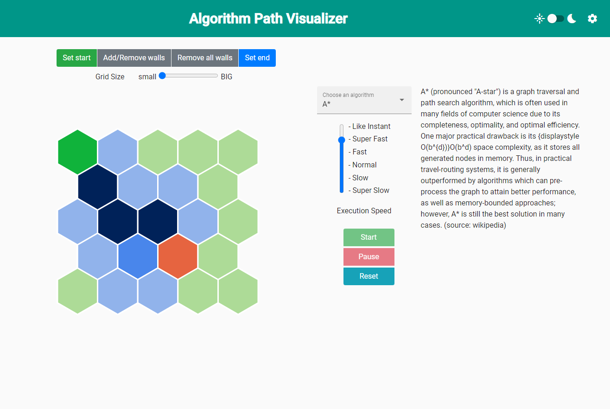
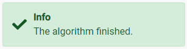
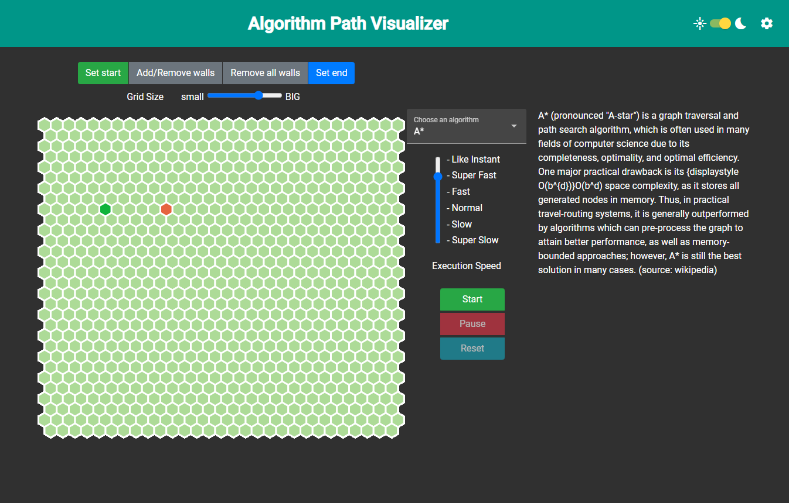

# Documentation
## Build, Develop and Test
Regarding the build, development and testing, everything is straight forward like in a standard angular application. Since this application has been generated by the angular cli, the auto generated [readme file](./../PathFindingVisualizer/README.md) of angular describes steps regarding the development.

## Deploy
The application can, additionally to the standard angular environment, deployed as a docker container. The Dockerfile in the root folder of the application can be used. To make it even simpler, docker-compose can be used to build and deploy at once. To build and deploy the application execute the following command in the root dir of the application
```
docker-compose up -d
```

## Interact with the application
<a name="interaction"></a>

The application can be divided into two main parts. The grid visualization and the algorithm part. The grid visualization part on the left side of the application visualized the current state of the grid and allows to interact with it. The right side of the application allows to interact with the algorithmic part of the application. Additionally the settings in the upper right corner allow to modify general configurations, which are not necessary for the main purpose of this application and thus not counted as main part.

### Grid

The grid consists of a square of hexagons, which initially symbolize a plane empty level. Every cell can have different states, which are static states or dynamic states.
 
#### Grid Cell
The static states describe attributes of a cell which are not modified during the execution of any algorithm. Whereas the dynamic states are states which are intermediate states during the execution or final states after the algorithm finished.

Static states:
- empty -> passable cell (marked light green)
- wall -> non passable cell (marked brownish)
- start cell -> the start of the path (marked green)
- end cell -> the goal of the path (marked red)

Dynamic states:
- in consideration -> cells which are already considered to visit by the algorithm (marked bright blue) 
- visited -> cells which have already been visited (marked dark blue)
- final path -> the cells which are on the actual final path (marked yellow)

The start and end state are unique and therefore only appear once at most, whereas the grid might be filled with a lot of walls.

#### Interaction with the Grid
The possible interactions are manipulations of the status of a grid cell. The dynamic states cannot be manipulated since those are a result of the algorithms execution. However, the static states can be manipulated.


The start, end and walls can be assigned by clicking the regarding button above the grid. Additionally all walls can be removed by one click, since there might be a few.

Furthermore, it is possible to change the size of the grid, which refers to the number of cells in every row and column.



 The two screenshots above show the contrast of the biggest and the smallest possible grid.

Resizing the grid into a smaller size removes all cell conditions which would refer to out of grid cells. Therefore, assume the end is set to the lower right corner. When resizing the grid to the next smaller representation, this constraint of being the end cell will be removed, so that a new end cell has to be defined. The same mechanic appears for walls and start cell constraints as well. 

## Algorithms
A path finding algorithm can be selected on the right side of the page. The dropdown offers multiple different algorithms, which can be seen in the screenshot below. A brief description of every algorithm is provided on the right of the selection.
 

##### A*
The well-known A* algorithm which searches for a path efficiently by weighting the possible cells by their possible distance to the end and the cost of getting to that current cell. 

##### Random Path
Random path does something similar to the A* algorithm, with the slight but major difference of not using a weighted queue of possible cells. Instead the next cell to visit is randomly selected out of all possible considered but not yet visited cells. 
##### Random Movement

The algorithm needs at least a start and an end cell to be started. Therefore an error message, like in the screenshot below, will be shown if one of those is not provided.


The algorithm control instruments are provided in the screenshot below. They provide the possibility to adjust the execution speed of the algorithm as well as control mechanisms which manipulate the execution.


Like the name suggests, 'run' starts algorithms path search. The grid on the left visualizes the process of the algorithm iteratively. The algorithm can be 'paused' and resumed without loosing any progress. The result of the algorithm shown in the grid can be removed by clicking on the 'reset' button.

The algorithm execution might not be successful since it is possible that a wall does not allow to access the end cell starting from the start cell. Nevertheless, a notification on the bottom right corner will show the result of the process.



## Settings
Two different kind of settings are provided to customize the user experience. The settings can be found in the right corner of the applications toolbar. The slider allows to set the whole application into dark mode, which is more pleasing in night times and doesn't exhaust the eyes. The slider in the screenshot below shows a sun on the left side and a moon on the right side. For obvious reasons, the moon represents night and thus dark mode.



The above screenshot shows the application in dark mode.

The more interesting settings can be opened by clicking the gear wheel symbol. This will open a popup window which is presented in the screenshot below. This window allows to adjust the different colors of the grid cells. Every row of this settings is one possible constraint of the grid. The constraint is stated at the beginning of the row. Further on, an input field allows to directly insert a color in hex format. The currently selected color is visualized by the painter palette next to the input field. The reset button at the end of each row allows to reset just that one color back to its original value. The 'Reset all colors' button at the bottom of the settings window accordingly allows to reset all colors at once.


For easier handling a color picker is already reachable by clicking on the colored painter palette. The color picker allows to select some predefined colors at the bottom and also to browse through colors and find an appealing color.
