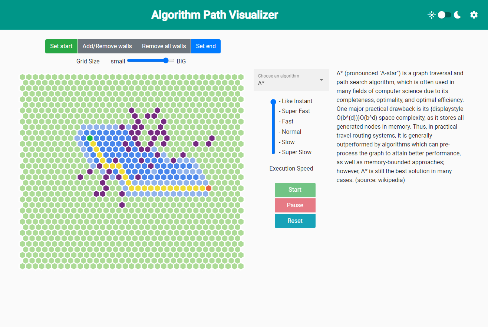
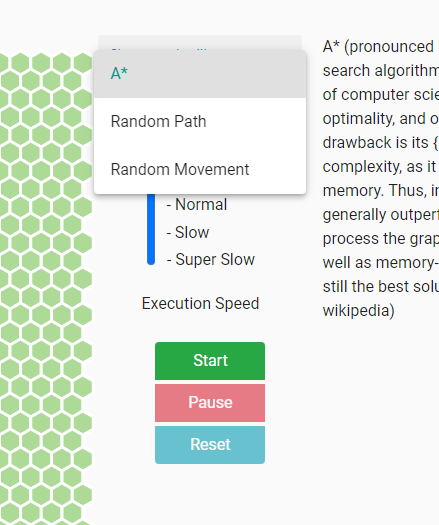

# Documentation
## Build, Develop and Test
Regarding the build, development and testing, everything is straight forward like in a standard angular application. Since this application has been generated by the angular cli, the auto generated [readme file](./../PathFindingVisualizer/README.md) of angular describes steps regarding the development.

## Deploy
The application can, additionally to the standard angular environment, deployed as a docker container. The Dockerfile in the root folder of the application can be used. To make it even simpler, docker-compose can be used to build and deploy at once. To build and deploy the application execute the following command in the root dir of the application
```
docker-compose up -d
```

## Interact with the application
<a name="interaction"></a>

The application can be divided into two main parts. The grid visualization and the algorithm part. The grid visualization part on the left side of the application visualized the current state of the grid and allows to interact with it. The right side of the application allows to interact with the algorithmic part of the application. Additionally the settings in the upper right corner allow to modify general configurations, which are not necessary for the main purpose of this application and thus not counted as main part.

### Grid

The grid consists of a square of hexagons, which initially symbolize a plane empty level. Every cell can have different states, which are static states or dynamic states.
 
#### Grid Cell
The static states describe attributes of a cell which are not modified during the execution of any algorithm. Whereas the dynamic states are states which are intermediate states during the execution or final states after the algorithm finished.

Static states:
- empty -> passable cell (marked light green)
- wall -> non passable cell (marked brownish)
- start cell -> the start of the path (marked green)
- end cell -> the goal of the path (marked red)

Dynamic states:
- in consideration -> cells which are already considered to visit by the algorithm (marked bright blue) 
- visited -> cells which have already been visited (marked dark blue)
- final path -> the cells which are on the actual final path (marked yellow)

The start and end state are unique and therefore only appear once at most, whereas the grid might be filled with a lot of walls.

#### Interaction with the Grid
The possible interactions are manipulations of the status of a grid cell. The dynamic states cannot be manipulated since those are a result of the algorithms execution. However, the static states can be manipulated.


The start, end and walls can be assigned by clicking the regarding button above the grid. Additionally all walls can be removed by one click, since there might be a few.

Furthermore, it is possible to change the size of the grid, which refers to the number of cells in every row and column. A grid with fewer cells is presented in the following screenshot.


In contrast, the biggest possible grid is presented in the following screenshot.


## Algorithms





## Settings


